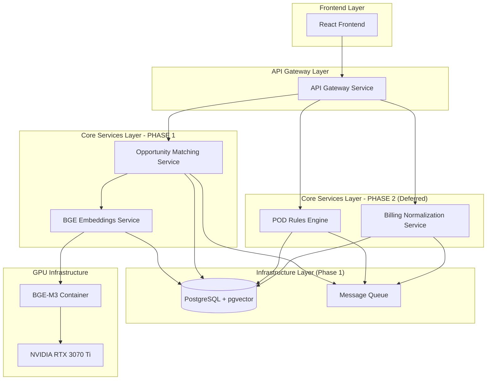

# Design Document

## Overview

> **CURRENT PHASE: BGE M3 Opportunity Matching Engine**
> 
> This design document reflects the current implementation focus on BGE-M3 opportunity matching. The full microservices architecture described here represents the long-term vision, with billing normalization and POD rules components deferred to subsequent phases.

The Core Platform Services design implements a microservices architecture that builds upon the database infrastructure foundation to provide FastAPI-based services and GPU-accelerated BGE-M3 embeddings for intelligent opportunity matching. **The current phase focuses exclusively on building the opportunity matching engine** using semantic similarity to match APN and Odoo opportunities. Additional services including billing normalization, POD rules engine, and React frontend are planned for future phases.

## Steering Document Alignment

### Technical Standards (tech.md)
*Note: No steering documents currently exist. Following industry best practices for:*
- FastAPI microservices with OpenAPI/Swagger documentation
- Container-first design with Docker and Docker Compose
- React frontend with modern hooks and TypeScript
- GPU containerization with NVIDIA Docker runtime
- Event-driven architecture with message queues

### Project Structure (structure.md)
*Note: Following the established structure from database infrastructure phase:*
- `/backend/services` - Numbered microservices extending the foundation
- `/frontend` - React application for monitoring and testing
- `/infrastructure` - Docker configurations including GPU containers
- `/scripts` - Numbered utility scripts for service management

## Code Reuse Analysis

### Existing Components to Leverage
Building directly on the database infrastructure foundation:
- **Database Connection Manager** (backend/core/database.py): Extended for microservices
- **Configuration Module** (backend/core/config.py): Extended with service-specific configs
- **Complete RAW Schema**: All 1,321 fields available for transformation
- **CORE Schema Tables**: Normalized opportunities and AWS accounts
- **OPS Schema**: Sync jobs and quality tracking infrastructure

### Integration Points
- **PostgreSQL Database**: Central data store with established schemas
- **Existing Data Pipeline**: RAW → CORE transformation scripts
- **Docker Infrastructure**: Extending existing container setup
- **Environment Configuration**: Building on established .env patterns

## Architecture

The architecture extends the database foundation with specialized microservices, each handling specific business capabilities while maintaining loose coupling through well-defined APIs and event-driven communication.

### Modular Design Principles
- **Service Isolation**: Each microservice runs independently with its own container and resources
- **API-First Design**: All services expose OpenAPI-documented REST endpoints
- **Event-Driven Communication**: Services communicate through message queues for async processing
- **Shared Data Layer**: All services access the same PostgreSQL database with proper connection pooling



## Components and Interfaces

### BGE Embeddings Service
- **Purpose:** Generate semantic embeddings using GPU-accelerated BGE-M3 model
- **Interfaces:** 
  - `POST /api/v1/embeddings/generate` - Generate embeddings for text input (batch support)
  - `GET /api/v1/embeddings/similarity` - Calculate similarity between embeddings
  - `GET /api/v1/embeddings/health` - GPU and model health status with memory usage
  - `GET /api/v1/embeddings/model/info` - Model version and configuration details
- **Dependencies:** NVIDIA RTX 3070 Ti, BGE-M3 container with GPU passthrough, SEARCH schema
- **Location:** `/backend/services/07-embeddings/`
- **Container Configuration:**
  - Base image: `nvidia/cuda:11.8-devel-ubuntu20.04` with PyTorch GPU
  - Model cache: `/models/bge-m3` volume mount for model weights
  - GPU access: `--gpus all` with NVIDIA Docker runtime
  - Memory limits: 6GB container limit for RTX 3070 Ti (8GB VRAM)
- **Performance Targets:** 
  - 32 embeddings per 500ms batch on RTX 3070 Ti
  - 1024-dimensional vectors (BGE-M3 specification)
  - Automatic fallback to CPU if GPU unavailable
- **Reuses:** Database connection manager, configuration module

### Opportunity Matching Service
- **Purpose:** Match Odoo opportunities with APN opportunities using advanced RRF (Reciprocal Rank Fusion) multi-method approach for 85-95% accuracy
- **Architecture:** Enhances existing placeholder service at port 8008 with 4-method fusion pipeline
- **Matching Methods:**
  1. **Semantic Similarity** - BGE-M3 embeddings for project description matching
  2. **Company Fuzzy Matching** - FuzzyWuzzy on company names extracted from identity_text
  3. **Domain Exact Matching** - Direct domain comparison from identity_text
  4. **Context Similarity** - BGE embeddings on business context from context_text
- **RRF Fusion Algorithm:**
  - Each method generates ranked candidate list with confidence scores
  - RRF combines rankings: `score = Σ(1/(k + rank_i))` where k=60 (tunable)
  - Final candidates ranked by combined RRF score for maximum accuracy
- **Performance Targets:** 
  - Two-stage retrieval: Fast BGE search (top 50) → Multi-method refinement
  - Target accuracy: 85-95% vs current 65-75% single-method approach
  - Response time: <2 seconds for candidate generation and scoring
- **Interfaces:**
  - `POST /api/v1/matching/opportunities/match` - Trigger RRF multi-method matching
  - `GET /api/v1/matching/opportunities/{id}/candidates` - Get RRF-ranked match candidates with method breakdown
  - `PUT /api/v1/matching/opportunities/{id}/confirm` - Confirm match selection with method attribution
  - `GET /api/v1/matching/health` - Service health with method-specific performance metrics
- **Dependencies:** BGE Embeddings Service, CORE schema (identity_text, context_text), OPS schema
- **Location:** `/backend/services/08-matching/`
- **Key Components:**
  - `matcher.py` - Main RRF fusion engine with 4-method implementation
  - `candidate_generator.py` - Two-stage retrieval pipeline (BGE → multi-method)
  - `config.py` - Method-specific thresholds and RRF k-value tuning
  - `utils/` - Company name extraction, domain parsing, similarity utilities
- **Reuses:** Database connection manager, existing CORE opportunity tables, BGE embeddings service

### POD Rules Engine **[PHASE 2 - DEFERRED]**
> **STATUS: DEFERRED** - POD rules engine implementation is deferred until opportunity matching provides the foundation data needed for effective rule evaluation.

- **Purpose:** Evaluate opportunities against configurable POD eligibility rules
- **Interfaces:**
  - `POST /api/v1/rules/pod/evaluate` - Evaluate opportunity against POD rules
  - `GET /api/v1/rules/pod/config` - Get current POD rules configuration
  - `PUT /api/v1/rules/pod/config` - Update POD rules configuration
- **Dependencies:** Billing Normalization Service, CORE schema, rules configuration
- **Location:** `/backend/services/09-rules/`
- **Reuses:** Database connection manager, OPS schema for decision tracking

### Billing Normalization Service **[PHASE 2 - DEFERRED]**
> **STATUS: DEFERRED** - Billing normalization tables have been successfully implemented and are operational. Service implementation is deferred until opportunity matching is complete.

- **Purpose:** Transform RAW billing data into normalized cost analysis tables
- **Interfaces:**
  - `POST /api/v1/billing/normalize` - Trigger billing data normalization
  - `GET /api/v1/billing/costs/{account_id}` - Get normalized cost data
  - `GET /api/v1/billing/spend-analysis/{customer_id}` - Get spend analysis for POD validation
- **Dependencies:** RAW billing tables, CORE schema
- **Location:** `/backend/services/10-billing/`
- **Reuses:** Database connection manager, existing RAW billing tables

### API Gateway Service
- **Purpose:** Centralized API routing, authentication, and request/response handling
- **Interfaces:**
  - `/*` - Route all requests to appropriate services
  - `GET /api/health` - Overall system health check
  - `GET /api/docs` - Consolidated API documentation
- **Dependencies:** All microservices, authentication system
- **Location:** `/backend/services/11-api-gateway/`
- **Reuses:** Configuration module for service discovery

### React Frontend Application
- **Purpose:** Web interface for monitoring, testing, and managing POD workflows
- **Interfaces:**
  - Dashboard for system status and metrics
  - Opportunity matching interface with similarity scores
  - POD rules configuration and testing
  - Billing analysis and cost visualization
- **Dependencies:** API Gateway Service
- **Location:** `/frontend/`
- **Reuses:** Existing project structure, styling patterns

## Data Architecture Separation

### CORE Schema (Business Data)
The CORE schema contains normalized business entities and maintains clean separation from vector operations:

- **core.opportunities**: Primary business opportunity data from Odoo and APN
- **identity_text**: Generated text combining company_name + company_domain for entity matching
- **context_text**: Generated text combining opportunity descriptions, use cases, and business context
- **identity_hash**: SHA-256 hash of identity_text for change detection (avoids re-embedding)
- **context_hash**: SHA-256 hash of context_text for change detection

### SEARCH Schema (Vector Operations)
The SEARCH schema is optimized for vector similarity operations and contains denormalized metadata for performance:

```sql
-- BGE-M3 embeddings for opportunity matching
CREATE TABLE search.embeddings_opportunities (
    id UUID PRIMARY KEY DEFAULT gen_random_uuid(),
    opportunity_id INTEGER NOT NULL,  -- References core.opportunities.opportunity_id
    source_system VARCHAR(50) NOT NULL,  -- 'odoo' or 'apn'
    source_id VARCHAR(255) NOT NULL,     -- Original system identifier
    embedding_type VARCHAR(50) NOT NULL, -- 'identity' or 'context'
    
    -- BGE-M3 vector storage (1024 dimensions)
    embed_vector_json JSONB,  -- JSON array of 1024 floats
    
    -- Denormalized metadata for fast filtering
    identity_text TEXT,
    context_text TEXT,
    text_hash VARCHAR(64),
    company_name VARCHAR(500),
    company_domain VARCHAR(255),
    
    -- Operational tracking
    model_version VARCHAR(50) DEFAULT 'bge-m3-v1.0',
    created_at TIMESTAMP DEFAULT CURRENT_TIMESTAMP,
    updated_at TIMESTAMP DEFAULT CURRENT_TIMESTAMP,
    
    -- Performance constraints
    UNIQUE(opportunity_id, embedding_type),  -- One identity + one context per opportunity
    INDEX ON opportunity_id,
    INDEX ON source_system,
    INDEX ON embedding_type,
    INDEX ON text_hash,  -- Fast change detection
    INDEX ON company_domain  -- Company matching
);
```

**Key Design Decisions:**
- **Separation of Concerns**: Business logic in CORE, vector operations in SEARCH
- **Denormalized Metadata**: Company info duplicated in SEARCH for query performance
- **Dual Embedding Strategy**: Identity embeddings for entity matching, context embeddings for semantic matching
- **Change Detection**: Hash-based system prevents unnecessary re-embedding
- **pgvector Ready**: Structure supports future pgvector VECTOR columns alongside current JSONB

## Data Models

### Extended CORE Schema Models

Building on the existing CORE schema, adding normalized billing and enhanced matching data:

```sql
-- Normalized Billing Summary (extends CORE schema)
CREATE TABLE core.billing_summary (
    summary_id UUID PRIMARY KEY DEFAULT gen_random_uuid(),
    account_id VARCHAR(20) NOT NULL,
    customer_id INTEGER,
    billing_period DATE NOT NULL,
    total_cost DECIMAL(15,2) NOT NULL,
    service_breakdown JSONB,
    usage_hours DECIMAL(10,2),
    -- For POD validation
    monthly_spend DECIMAL(15,2),
    quarterly_spend DECIMAL(15,2),
    yearly_spend DECIMAL(15,2),
    -- Metadata
    created_at TIMESTAMP DEFAULT CURRENT_TIMESTAMP,
    updated_at TIMESTAMP DEFAULT CURRENT_TIMESTAMP,
    UNIQUE(account_id, billing_period)
);

-- Opportunity Matching Results (extends CORE schema)
CREATE TABLE core.opportunity_matches (
    match_id UUID PRIMARY KEY DEFAULT gen_random_uuid(),
    odoo_opportunity_id UUID NOT NULL,
    ace_opportunity_id UUID,
    
    -- RRF Fusion Scoring
    rrf_combined_score DECIMAL(8,6) NOT NULL, -- Combined RRF score across all methods
    similarity_score DECIMAL(5,4) NOT NULL,   -- Legacy compatibility field
    match_confidence VARCHAR(50) NOT NULL,    -- 'high', 'medium', 'low' based on RRF score
    
    -- Method-Specific Scores
    semantic_score DECIMAL(5,4),           -- BGE semantic similarity score
    company_fuzzy_score DECIMAL(5,4),      -- FuzzyWuzzy company name matching score
    domain_exact_match BOOLEAN,            -- Boolean: exact domain match found
    context_similarity_score DECIMAL(5,4), -- BGE context similarity score
    
    -- Method Rankings (for RRF calculation)
    semantic_rank INTEGER,                 -- Rank in semantic similarity results
    company_fuzzy_rank INTEGER,            -- Rank in company fuzzy matching results
    domain_exact_rank INTEGER,             -- Rank in domain matching results (1 if exact, NULL if no match)
    context_similarity_rank INTEGER,       -- Rank in context similarity results
    
    -- Match Attribution
    primary_match_method VARCHAR(100) NOT NULL, -- 'rrf_fusion', 'semantic', 'domain', 'fuzzy_name', 'context'
    contributing_methods TEXT[],           -- Array of methods that contributed to the match
    match_explanation TEXT,               -- Human-readable explanation of match reasoning
    
    -- Workflow Status
    status VARCHAR(50) DEFAULT 'pending', -- 'pending', 'confirmed', 'rejected'
    reviewed_by VARCHAR(255),
    reviewed_at TIMESTAMP,
    created_at TIMESTAMP DEFAULT CURRENT_TIMESTAMP,
    
    -- Performance Indexes
    INDEX ON rrf_combined_score,
    INDEX ON match_confidence,
    INDEX ON primary_match_method,
    INDEX ON status,
    
    FOREIGN KEY (odoo_opportunity_id) REFERENCES core.opportunities(opportunity_id),
    FOREIGN KEY (ace_opportunity_id) REFERENCES core.opportunities(opportunity_id)
);

-- POD Rules Evaluation Results (extends OPS schema)
CREATE TABLE ops.pod_evaluations (
    evaluation_id UUID PRIMARY KEY DEFAULT gen_random_uuid(),
    opportunity_match_id UUID NOT NULL,
    rules_version VARCHAR(50) NOT NULL,
    -- Rule results
    partner_originated_pass BOOLEAN,
    spend_threshold_pass BOOLEAN,
    timeline_pass BOOLEAN,
    overall_result VARCHAR(50) NOT NULL, -- 'eligible', 'ineligible', 'review_required'
    failure_reasons TEXT[],
    -- Spend analysis
    customer_monthly_spend DECIMAL(15,2),
    spend_threshold_amount DECIMAL(15,2),
    -- Decision tracking
    final_decision VARCHAR(50), -- 'approved', 'rejected', 'pending'
    decision_reason TEXT,
    decided_by VARCHAR(255),
    decided_at TIMESTAMP,
    created_at TIMESTAMP DEFAULT CURRENT_TIMESTAMP,
    FOREIGN KEY (opportunity_match_id) REFERENCES core.opportunity_matches(match_id)
);
```

### Service Configuration Models

```python
# BGE Service Configuration
class BGEConfig(BaseModel):
    model_name: str = "BAAI/bge-m3"
    embedding_dim: int = 1024
    max_batch_size: int = 32
    gpu_device: int = 0
    max_sequence_length: int = 8192
    similarity_threshold: float = 0.7

# RRF Fusion Matching Configuration
class MatchingConfig(BaseModel):
    # RRF Parameters
    rrf_k_value: int = 60                    # RRF k parameter for rank fusion
    top_candidates_stage1: int = 50          # Candidates from fast BGE search
    top_candidates_final: int = 10           # Final candidates after RRF fusion
    
    # Method-Specific Thresholds
    semantic_similarity_threshold: float = 0.65      # BGE semantic similarity
    company_fuzzy_threshold: float = 0.80            # FuzzyWuzzy company matching
    context_similarity_threshold: float = 0.70       # BGE context similarity
    
    # Confidence Calibration
    confidence_high_threshold: float = 0.85          # Auto-approve threshold
    confidence_medium_threshold: float = 0.70        # Manual review threshold
    confidence_low_threshold: float = 0.50           # Rejection threshold
    
    # Method Weights (for score normalization)
    semantic_weight: float = 0.35
    company_fuzzy_weight: float = 0.25
    domain_exact_weight: float = 0.25
    context_similarity_weight: float = 0.15

# POD Rules Configuration
class PODRulesConfig(BaseModel):
    spend_threshold_monthly: Decimal = Decimal("5000.00")
    partner_originated_required: bool = True
    timeline_days_max: int = 90
    confidence_threshold_auto_approve: float = 0.85
    confidence_threshold_manual_review: float = 0.7
```

## Error Handling

### Error Scenarios

1. **GPU Service Unavailable**
   - **Handling:** Fall back to CPU processing with performance warnings
   - **User Impact:** Slower embedding generation but continued functionality
   - **Monitoring:** Alert on GPU utilization drops and thermal throttling

2. **BGE Model Loading Failure**
   - **Handling:** Retry model loading with exponential backoff
   - **User Impact:** Embedding service temporarily unavailable
   - **Recovery:** Queue embedding requests for processing when service recovers

3. **Opportunity Matching Low Confidence**
   - **Handling:** Flag for manual review with method-specific breakdown
   - **User Impact:** Manual review required for ambiguous matches with RRF score analysis
   - **Workflow:** Send to review queue with detailed multi-method similarity analysis and contributing method attribution

4. **POD Rules Evaluation Failure**
   - **Handling:** Mark opportunity as requiring manual review
   - **User Impact:** Compliance team reviews manually
   - **Audit:** Full rule evaluation log stored for troubleshooting

5. **RRF Fusion Method Failure**
   - **Handling:** Fall back to single best-performing method (semantic similarity)
   - **User Impact:** Slightly reduced matching accuracy but continued operation
   - **Recovery:** Log method failures and retry with reduced method set
   - **Monitoring:** Alert on method-specific failure rates and performance degradation

6. **Billing Data Inconsistency**
   - **Handling:** Flag billing anomalies and continue with available data
   - **User Impact:** Spend validation may be incomplete
   - **Resolution:** Billing team investigates data quality issues

## Testing Strategy

### Unit Testing
- **Service Logic:** Test each microservice business logic with mocked dependencies
- **BGE Integration:** Test embedding generation with sample data
- **Rules Engine:** Test POD rules with various opportunity scenarios
- **API Endpoints:** Test all REST endpoints with realistic payloads
- **Frontend Components:** Test React components with Jest and React Testing Library

### Integration Testing
- **Service Communication:** Test API calls between microservices
- **Database Integration:** Test CRUD operations and complex queries
- **GPU Pipeline:** Test end-to-end BGE embedding workflow
- **RRF Matching Pipeline:** Test complete 4-method opportunity matching workflow
- **Multi-Method Validation:** Test RRF fusion algorithm with various candidate combinations
- **Method Fallback:** Test degraded matching when individual methods fail
- **Rules Evaluation:** Test POD rules against real opportunity data

### End-to-End Testing
- **Complete POD Workflow:** Test from opportunity ingestion to final POD decision
- **Frontend Integration:** Test React interface with real API responses
- **Performance Testing:** Test system performance under load including GPU utilization
- **Error Recovery:** Test system behavior during service failures
- **Multi-User Scenarios:** Test concurrent user access and workflow management

### Performance Testing
- **BGE Throughput:** Target 32 embeddings per 500ms batch on RTX 3070 Ti
- **RRF Matching Performance:** Complete 4-method matching under 2 seconds for 50 candidates
- **Method-Specific Performance:** Individual method timings (semantic: <500ms, fuzzy: <200ms, domain: <50ms, context: <500ms)
- **API Response Times:** All endpoints under 2 seconds for normal operations
- **Database Query Performance:** Complex matching queries under 100ms with method-specific indexes
- **Frontend Load Times:** Initial dashboard load under 3 seconds
- **Concurrent Users:** Support 10+ concurrent users without performance degradation
- **Accuracy Benchmarking:** A/B testing RRF fusion vs single-method approach on validation dataset