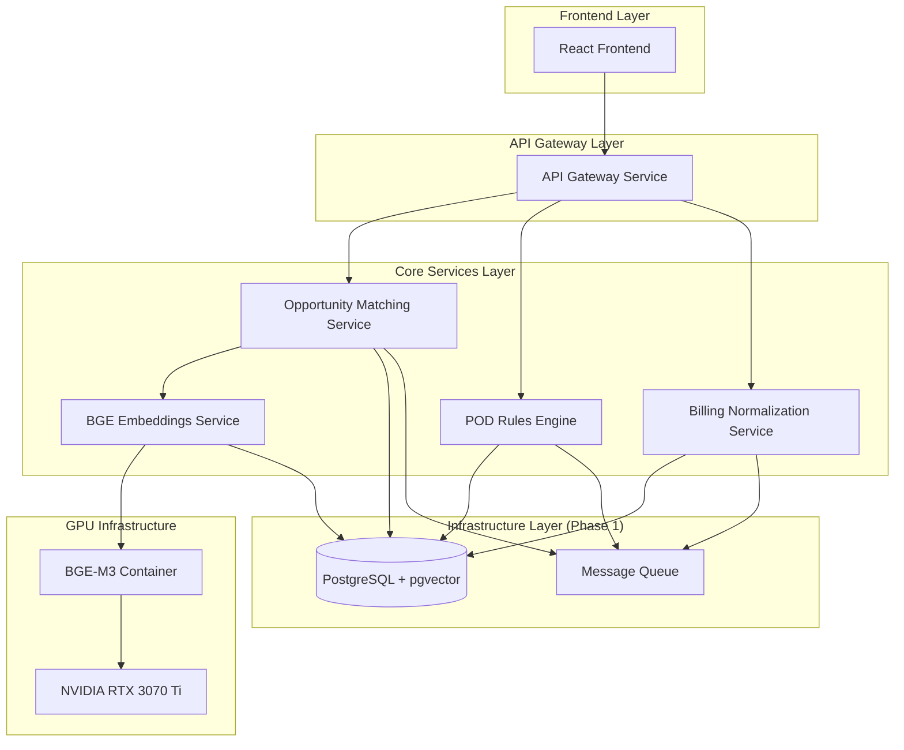

# Design Document

## Overview

The Core Platform Services design implements a microservices architecture that builds upon the database infrastructure foundation to provide FastAPI-based services, GPU-accelerated BGE-M3 embeddings, intelligent opportunity matching, and a React frontend interface. The system follows event-driven patterns with clear service boundaries, leveraging the existing database schemas while adding sophisticated business logic and AI-powered matching capabilities.

## Steering Document Alignment

### Technical Standards (tech.md)
*Note: No steering documents currently exist. Following industry best practices for:*
- FastAPI microservices with OpenAPI/Swagger documentation
- Container-first design with Docker and Docker Compose
- React frontend with modern hooks and TypeScript
- GPU containerization with NVIDIA Docker runtime
- Event-driven architecture with message queues

### Project Structure (structure.md)
*Note: Following the established structure from database infrastructure phase:*
- `/backend/services` - Numbered microservices extending the foundation
- `/frontend` - React application for monitoring and testing
- `/infrastructure` - Docker configurations including GPU containers
- `/scripts` - Numbered utility scripts for service management

## Code Reuse Analysis

### Existing Components to Leverage
Building directly on the database infrastructure foundation:
- **Database Connection Manager** (backend/core/database.py): Extended for microservices
- **Configuration Module** (backend/core/config.py): Extended with service-specific configs
- **Complete RAW Schema**: All 1,321 fields available for transformation
- **CORE Schema Tables**: Normalized opportunities and AWS accounts
- **OPS Schema**: Sync jobs and quality tracking infrastructure

### Integration Points
- **PostgreSQL Database**: Central data store with established schemas
- **Existing Data Pipeline**: RAW → CORE transformation scripts
- **Docker Infrastructure**: Extending existing container setup
- **Environment Configuration**: Building on established .env patterns

## Architecture

The architecture extends the database foundation with specialized microservices, each handling specific business capabilities while maintaining loose coupling through well-defined APIs and event-driven communication.

### Modular Design Principles
- **Service Isolation**: Each microservice runs independently with its own container and resources
- **API-First Design**: All services expose OpenAPI-documented REST endpoints
- **Event-Driven Communication**: Services communicate through message queues for async processing
- **Shared Data Layer**: All services access the same PostgreSQL database with proper connection pooling



## Components and Interfaces

### BGE Embeddings Service
- **Purpose:** Generate semantic embeddings using GPU-accelerated BGE-M3 model
- **Interfaces:** 
  - `POST /api/v1/embeddings/generate` - Generate embeddings for text input
  - `GET /api/v1/embeddings/similarity` - Calculate similarity between embeddings
  - `GET /api/v1/embeddings/health` - GPU and model health status
- **Dependencies:** NVIDIA RTX 3070 Ti, BGE-M3 container, SEARCH schema
- **Location:** `/backend/services/07-embeddings/`
- **Reuses:** Database connection manager, configuration module

### Opportunity Matching Service
- **Purpose:** Match Odoo opportunities with ACE opportunities using semantic similarity
- **Interfaces:**
  - `POST /api/v1/matching/opportunities/match` - Trigger opportunity matching
  - `GET /api/v1/matching/opportunities/{id}/candidates` - Get match candidates
  - `PUT /api/v1/matching/opportunities/{id}/confirm` - Confirm match selection
- **Dependencies:** BGE Embeddings Service, CORE schema, OPS schema
- **Location:** `/backend/services/08-matching/`
- **Reuses:** Database connection manager, existing CORE opportunity tables

### POD Rules Engine
- **Purpose:** Evaluate opportunities against configurable POD eligibility rules
- **Interfaces:**
  - `POST /api/v1/rules/pod/evaluate` - Evaluate opportunity against POD rules
  - `GET /api/v1/rules/pod/config` - Get current POD rules configuration
  - `PUT /api/v1/rules/pod/config` - Update POD rules configuration
- **Dependencies:** Billing Normalization Service, CORE schema, rules configuration
- **Location:** `/backend/services/09-rules/`
- **Reuses:** Database connection manager, OPS schema for decision tracking

### Billing Normalization Service
- **Purpose:** Transform RAW billing data into normalized cost analysis tables
- **Interfaces:**
  - `POST /api/v1/billing/normalize` - Trigger billing data normalization
  - `GET /api/v1/billing/costs/{account_id}` - Get normalized cost data
  - `GET /api/v1/billing/spend-analysis/{customer_id}` - Get spend analysis for POD validation
- **Dependencies:** RAW billing tables, CORE schema
- **Location:** `/backend/services/10-billing/`
- **Reuses:** Database connection manager, existing RAW billing tables

### API Gateway Service
- **Purpose:** Centralized API routing, authentication, and request/response handling
- **Interfaces:**
  - `/*` - Route all requests to appropriate services
  - `GET /api/health` - Overall system health check
  - `GET /api/docs` - Consolidated API documentation
- **Dependencies:** All microservices, authentication system
- **Location:** `/backend/services/11-api-gateway/`
- **Reuses:** Configuration module for service discovery

### React Frontend Application
- **Purpose:** Web interface for monitoring, testing, and managing POD workflows
- **Interfaces:**
  - Dashboard for system status and metrics
  - Opportunity matching interface with similarity scores
  - POD rules configuration and testing
  - Billing analysis and cost visualization
- **Dependencies:** API Gateway Service
- **Location:** `/frontend/`
- **Reuses:** Existing project structure, styling patterns

## Data Models

### Extended CORE Schema Models

Building on the existing CORE schema, adding normalized billing and enhanced matching data:

```sql
-- Normalized Billing Summary (extends CORE schema)
CREATE TABLE core.billing_summary (
    summary_id UUID PRIMARY KEY DEFAULT gen_random_uuid(),
    account_id VARCHAR(20) NOT NULL,
    customer_id INTEGER,
    billing_period DATE NOT NULL,
    total_cost DECIMAL(15,2) NOT NULL,
    service_breakdown JSONB,
    usage_hours DECIMAL(10,2),
    -- For POD validation
    monthly_spend DECIMAL(15,2),
    quarterly_spend DECIMAL(15,2),
    yearly_spend DECIMAL(15,2),
    -- Metadata
    created_at TIMESTAMP DEFAULT CURRENT_TIMESTAMP,
    updated_at TIMESTAMP DEFAULT CURRENT_TIMESTAMP,
    UNIQUE(account_id, billing_period)
);

-- Opportunity Matching Results (extends CORE schema)
CREATE TABLE core.opportunity_matches (
    match_id UUID PRIMARY KEY DEFAULT gen_random_uuid(),
    odoo_opportunity_id UUID NOT NULL,
    ace_opportunity_id UUID,
    similarity_score DECIMAL(5,4) NOT NULL,
    match_confidence VARCHAR(50) NOT NULL, -- 'high', 'medium', 'low'
    match_method VARCHAR(100) NOT NULL, -- 'semantic', 'domain', 'fuzzy_name'
    match_explanation TEXT,
    status VARCHAR(50) DEFAULT 'pending', -- 'pending', 'confirmed', 'rejected'
    reviewed_by VARCHAR(255),
    reviewed_at TIMESTAMP,
    created_at TIMESTAMP DEFAULT CURRENT_TIMESTAMP,
    FOREIGN KEY (odoo_opportunity_id) REFERENCES core.odoo_opportunities(opportunity_id),
    FOREIGN KEY (ace_opportunity_id) REFERENCES core.ace_opportunities(opportunity_id)
);

-- POD Rules Evaluation Results (extends OPS schema)
CREATE TABLE ops.pod_evaluations (
    evaluation_id UUID PRIMARY KEY DEFAULT gen_random_uuid(),
    opportunity_match_id UUID NOT NULL,
    rules_version VARCHAR(50) NOT NULL,
    -- Rule results
    partner_originated_pass BOOLEAN,
    spend_threshold_pass BOOLEAN,
    timeline_pass BOOLEAN,
    overall_result VARCHAR(50) NOT NULL, -- 'eligible', 'ineligible', 'review_required'
    failure_reasons TEXT[],
    -- Spend analysis
    customer_monthly_spend DECIMAL(15,2),
    spend_threshold_amount DECIMAL(15,2),
    -- Decision tracking
    final_decision VARCHAR(50), -- 'approved', 'rejected', 'pending'
    decision_reason TEXT,
    decided_by VARCHAR(255),
    decided_at TIMESTAMP,
    created_at TIMESTAMP DEFAULT CURRENT_TIMESTAMP,
    FOREIGN KEY (opportunity_match_id) REFERENCES core.opportunity_matches(match_id)
);
```

### Service Configuration Models

```python
# BGE Service Configuration
class BGEConfig(BaseModel):
    model_name: str = "BAAI/bge-m3"
    embedding_dim: int = 1024
    max_batch_size: int = 32
    gpu_device: int = 0
    max_sequence_length: int = 8192
    similarity_threshold: float = 0.7

# POD Rules Configuration
class PODRulesConfig(BaseModel):
    spend_threshold_monthly: Decimal = Decimal("5000.00")
    partner_originated_required: bool = True
    timeline_days_max: int = 90
    confidence_threshold_auto_approve: float = 0.85
    confidence_threshold_manual_review: float = 0.7
```

## Error Handling

### Error Scenarios

1. **GPU Service Unavailable**
   - **Handling:** Fall back to CPU processing with performance warnings
   - **User Impact:** Slower embedding generation but continued functionality
   - **Monitoring:** Alert on GPU utilization drops and thermal throttling

2. **BGE Model Loading Failure**
   - **Handling:** Retry model loading with exponential backoff
   - **User Impact:** Embedding service temporarily unavailable
   - **Recovery:** Queue embedding requests for processing when service recovers

3. **Opportunity Matching Low Confidence**
   - **Handling:** Flag for manual review instead of auto-processing
   - **User Impact:** Manual review required for ambiguous matches
   - **Workflow:** Send to review queue with detailed similarity analysis

4. **POD Rules Evaluation Failure**
   - **Handling:** Mark opportunity as requiring manual review
   - **User Impact:** Compliance team reviews manually
   - **Audit:** Full rule evaluation log stored for troubleshooting

5. **Billing Data Inconsistency**
   - **Handling:** Flag billing anomalies and continue with available data
   - **User Impact:** Spend validation may be incomplete
   - **Resolution:** Billing team investigates data quality issues

## Testing Strategy

### Unit Testing
- **Service Logic:** Test each microservice business logic with mocked dependencies
- **BGE Integration:** Test embedding generation with sample data
- **Rules Engine:** Test POD rules with various opportunity scenarios
- **API Endpoints:** Test all REST endpoints with realistic payloads
- **Frontend Components:** Test React components with Jest and React Testing Library

### Integration Testing
- **Service Communication:** Test API calls between microservices
- **Database Integration:** Test CRUD operations and complex queries
- **GPU Pipeline:** Test end-to-end BGE embedding workflow
- **Matching Workflow:** Test complete opportunity matching pipeline
- **Rules Evaluation:** Test POD rules against real opportunity data

### End-to-End Testing
- **Complete POD Workflow:** Test from opportunity ingestion to final POD decision
- **Frontend Integration:** Test React interface with real API responses
- **Performance Testing:** Test system performance under load including GPU utilization
- **Error Recovery:** Test system behavior during service failures
- **Multi-User Scenarios:** Test concurrent user access and workflow management

### Performance Testing
- **BGE Throughput:** Target 32 embeddings per 500ms batch on RTX 3070 Ti
- **API Response Times:** All endpoints under 2 seconds for normal operations
- **Database Query Performance:** Complex matching queries under 100ms
- **Frontend Load Times:** Initial dashboard load under 3 seconds
- **Concurrent Users:** Support 10+ concurrent users without performance degradation