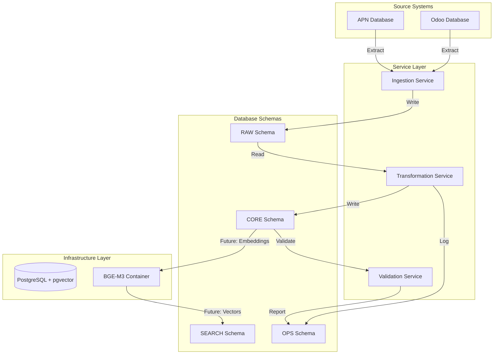

# Design Document

## Overview

The database infrastructure design implements a multi-layered data architecture that separates concerns across distinct schemas while maintaining data lineage and enabling high-performance operations. The system uses PostgreSQL with pgvector extension as the core database, containerized microservices for data processing, and a clear data flow pattern from source systems through raw storage, normalization, and ultimately to AI-powered embeddings for semantic search. This design prioritizes data integrity, scalability, and the ability to adapt to changing source system schemas.

## Steering Document Alignment

### Technical Standards (tech.md)
*Note: No steering documents currently exist. Following industry best practices for:*
- PostgreSQL database design patterns
- Docker containerization standards
- Python microservices with FastAPI
- Environment-based configuration management
- Structured logging and monitoring

### Project Structure (structure.md)
*Note: Following the proposed structure from Project_Plan.md:*
- `/infrastructure` - Docker and database setup
- `/backend/services` - Numbered microservices (01-ingestion, 02-transformation, etc.)
- `/scripts` - Numbered utility scripts with clear purposes
- Maximum 15 scripts per directory with strategic reuse

## Code Reuse Analysis

### Existing Components to Leverage
Since this is a greenfield project, we'll establish foundational components that future phases will build upon:
- **Database Connection Manager**: Pooled connections with retry logic that all services will use
- **Configuration Module**: Centralized environment variable management
- **Base Service Class**: Common patterns for health checks, logging, error handling
- **Data Validation Framework**: Reusable validation rules and quality checks

### Integration Points
- **PostgreSQL Database**: Central data store for all services
- **Docker Network**: Inter-service communication via container networking
- **Environment Configuration**: Shared .env file for all services
- **Logging Infrastructure**: Centralized structured logging for monitoring

## Architecture

The architecture follows a microservices pattern with clear service boundaries and responsibilities. Each service is containerized and communicates through well-defined interfaces.

### Modular Design Principles
- **Single File Responsibility**: Each script handles one specific operation (e.g., `01_create_database.sh`, `02_setup_schemas.py`)
- **Component Isolation**: Services run in separate containers with defined APIs
- **Service Layer Separation**: Clear separation between ingestion, transformation, and validation layers
- **Utility Modularity**: Shared utilities in `/backend/core` for database connections, logging, configuration



## Components and Interfaces

### Database Connection Manager
- **Purpose:** Manage PostgreSQL connections with pooling and retry logic
- **Interfaces:** 
  - `get_connection()` - Returns a database connection from pool
  - `execute_query()` - Execute SQL with automatic retry
  - `bulk_insert()` - Optimized bulk data insertion
- **Dependencies:** psycopg2, connection pool configuration
- **Location:** `/backend/core/database.py`

### Ingestion Service
- **Purpose:** Extract data from source systems and store in RAW schema
- **Interfaces:**
  - `POST /api/v1/ingestion/odoo/sync` - Trigger Odoo data sync
  - `POST /api/v1/ingestion/apn/sync` - Trigger APN data sync
  - `GET /api/v1/ingestion/status/{job_id}` - Check sync status
- **Dependencies:** Database Connection Manager, source system credentials
- **Location:** `/backend/services/01-ingestion/`

### Transformation Service
- **Purpose:** Transform RAW data into normalized CORE entities
- **Interfaces:**
  - `POST /api/v1/transform/opportunities` - Transform opportunity data
  - `POST /api/v1/transform/billing` - Transform billing records
  - `GET /api/v1/transform/status/{job_id}` - Check transformation status
- **Dependencies:** Database Connection Manager, transformation rules
- **Location:** `/backend/services/02-transformation/`

### Validation Service
- **Purpose:** Validate data quality and integrity
- **Interfaces:**
  - `POST /api/v1/validate/run` - Run validation checks
  - `GET /api/v1/validate/report/{run_id}` - Get validation report
  - `GET /api/v1/validate/metrics` - Get quality metrics
- **Dependencies:** Database Connection Manager, validation rules
- **Location:** `/backend/services/03-validation/`

### Configuration Module
- **Purpose:** Centralized configuration management
- **Interfaces:**
  - `get_config()` - Load configuration from environment
  - `validate_config()` - Ensure required variables are set
- **Dependencies:** python-dotenv, environment variables
- **Location:** `/backend/core/config.py`

## Data Models

### RAW Schema Tables - Complete Field Definitions

**IMPORTANT:** The complete RAW schema with ALL 1,321 fields from source systems is defined in:
- **Schema Definition:** `/data/schemas/sql/complete_raw_schema.sql` 
- **Field Discovery:** `/data/schemas/discovery/complete_schemas_merged.json`

#### Summary of Tables and Field Counts

**Odoo Tables (17 tables, 1,134 fields total):**
- `raw.odoo_crm_lead` - 179 fields (CRM opportunities/leads)
- `raw.odoo_res_partner` - 157 fields (Partners/companies/contacts)
- `raw.odoo_crm_team` - 29 fields (CRM teams)
- `raw.odoo_crm_stage` - 12 fields (CRM stages)
- `raw.odoo_sale_order` - 101 fields (Sales orders)
- `raw.odoo_sale_order_line` - 51 fields (Sales order line items)
- `raw.odoo_c_aws_accounts` - 78 fields (AWS account records)
- `raw.odoo_c_aws_funding_request` - 71 fields (Funding requests)
- `raw.odoo_res_country_state` - 8 fields (Geographic states/provinces)
- `raw.odoo_c_billing_spp_bill` - 16 fields (SPP billing records)
- `raw.odoo_product_template` - 107 fields (Product catalog)
- `raw.odoo_account_move` - 75 fields (Financial transactions/invoices)
- `raw.odoo_account_move_line` - 59 fields (Invoice line items)
- `raw.odoo_project_project` - 148 fields (Projects)
- `raw.odoo_c_billing_internal_cur` - 14 fields (AWS actual costs)
- `raw.odoo_c_billing_bill` - 16 fields (Invoice staging)
- `raw.odoo_c_billing_bill_line` - 13 fields (Invoice line items)

**APN Tables (6 tables, 187 fields total):**
- `raw.apn_opportunity` - 66 fields (ACE opportunities)
- `raw.apn_funding_request` - 57 fields (Funding requests)
- `raw.apn_cash_claim` - 26 fields (Cash claims for funding)
- `raw.apn_funding_request_history` - 14 fields (Funding request audit trail)
- `raw.apn_end_user` - 18 fields (End customer information)
- `raw.apn_users` - 6 fields (APN user accounts)

#### RAW Table Structure Pattern

All RAW tables follow this consistent structure:

```sql
-- Standard RAW table structure
CREATE TABLE raw.<source>_<table_name> (
    -- Metadata fields (always present)
    _raw_id SERIAL PRIMARY KEY,
    _ingested_at TIMESTAMP DEFAULT CURRENT_TIMESTAMP,
    _source_system VARCHAR(50) DEFAULT '<source>',  -- 'odoo' or 'apn'
    _sync_batch_id UUID,
    
    -- Source system fields (varies by table)
    -- All original fields from source system are preserved with exact types
    -- See complete_raw_schema.sql for full field definitions
);
```

**Complete Table Definitions:** 
- Full CREATE TABLE statements with ALL 1,321 fields are in `/data/schemas/sql/complete_raw_schema.sql`
- No fields are excluded - every source field is mirrored exactly
- Metadata fields (_raw_id, _ingested_at, etc.) are added for tracking

### CORE Schema Models (Normalized for Embeddings)

**Note:** CORE schema focuses on resolving all foreign keys to human-readable names for embedding generation. Billing tables will be designed in a future phase when requirements are clearer.

```sql
-- Normalized Odoo Opportunities with Resolved Names
CREATE TABLE core.odoo_opportunities (
    opportunity_id UUID PRIMARY KEY DEFAULT gen_random_uuid(),
    source_id INTEGER NOT NULL,
    name VARCHAR(500) NOT NULL,
    
    -- Partner/Company (resolved from res_partner)
    partner_id INTEGER,
    partner_name VARCHAR(500),
    partner_email VARCHAR(255),
    partner_phone VARCHAR(100),
    partner_website VARCHAR(255),
    partner_street VARCHAR(500),
    partner_city VARCHAR(200),
    partner_state VARCHAR(200),
    partner_country VARCHAR(200),
    partner_is_company BOOLEAN,
    
    -- User/Owner (resolved from res_users)
    user_id INTEGER,
    user_name VARCHAR(500),
    user_email VARCHAR(255),
    
    -- Team (resolved from crm_team)
    team_id INTEGER,
    team_name VARCHAR(200),
    
    -- Stage (resolved from crm_stage)
    stage_id INTEGER,
    stage_name VARCHAR(200),
    stage_sequence INTEGER,
    
    -- AWS specific (resolved from c_aws_accounts)
    aws_account_id VARCHAR(20),
    aws_account_name VARCHAR(500),
    aws_account_alias VARCHAR(200),
    aws_payer_account_id VARCHAR(20),
    aws_payer_account_name VARCHAR(500),
    
    -- Financial
    probability DECIMAL(5,2),
    expected_revenue DECIMAL(15,2),
    
    -- POD specific
    origination VARCHAR(50),
    c_aws_am_name VARCHAR(500),
    c_aws_psm_name VARCHAR(500),
    
    -- Dates
    create_date TIMESTAMP,
    close_date TIMESTAMP,
    date_deadline DATE,
    
    -- Normalized fields for matching
    domain VARCHAR(255),
    normalized_domain VARCHAR(255),
    normalized_company_name VARCHAR(500),
    
    -- For embeddings
    combined_text TEXT,  -- Concatenated searchable text
    
    -- Metadata
    created_at TIMESTAMP DEFAULT CURRENT_TIMESTAMP,
    updated_at TIMESTAMP DEFAULT CURRENT_TIMESTAMP,
    UNIQUE(source_id)
);

CREATE INDEX idx_odoo_opp_aws_account ON core.odoo_opportunities(aws_account_id);
CREATE INDEX idx_odoo_opp_domain ON core.odoo_opportunities(normalized_domain);
CREATE INDEX idx_odoo_opp_partner ON core.odoo_opportunities(partner_id);

-- Normalized ACE Opportunities (already has most names)
CREATE TABLE core.ace_opportunities (
    opportunity_id UUID PRIMARY KEY DEFAULT gen_random_uuid(),
    source_id VARCHAR(100) NOT NULL,
    name VARCHAR(500) NOT NULL,
    
    -- Company/Account
    account_name VARCHAR(500),
    customer_email VARCHAR(255),
    customer_name VARCHAR(500),
    
    -- AWS Account (resolved if possible)
    aws_account VARCHAR(20),
    aws_account_name VARCHAR(500),  -- Resolved from core.aws_accounts
    
    -- Financial
    project_budget DECIMAL(15,2),
    
    -- POD specific fields
    opportunity_type VARCHAR(100),
    opportunity_ownership VARCHAR(100),
    delivery_model VARCHAR(100),
    use_case VARCHAR(200),
    industry VARCHAR(100),
    
    -- Contacts
    partner_sales_rep_name VARCHAR(500),
    partner_sales_rep_email VARCHAR(255),
    aws_sales_rep_name VARCHAR(500),
    aws_sales_rep_email VARCHAR(255),
    psm_name VARCHAR(500),
    psm_email VARCHAR(255),
    
    -- Status
    status VARCHAR(100),
    aws_status VARCHAR(100),
    partner_acceptance_status VARCHAR(100),
    
    -- Dates
    close_date DATE,
    aws_create_date TIMESTAMP,
    aws_last_modified_date TIMESTAMP,
    
    -- Normalized fields for matching
    domain VARCHAR(255),
    normalized_domain VARCHAR(255),
    normalized_company_name VARCHAR(500),
    
    -- For embeddings
    combined_text TEXT,  -- Concatenated searchable text
    
    -- Metadata
    created_at TIMESTAMP DEFAULT CURRENT_TIMESTAMP,
    updated_at TIMESTAMP DEFAULT CURRENT_TIMESTAMP,
    UNIQUE(source_id)
);

CREATE INDEX idx_ace_opp_aws_account ON core.ace_opportunities(aws_account);
CREATE INDEX idx_ace_opp_domain ON core.ace_opportunities(normalized_domain);
CREATE INDEX idx_ace_opp_status ON core.ace_opportunities(status);

-- AWS Accounts Master with Resolved Names
CREATE TABLE core.aws_accounts (
    account_id VARCHAR(20) PRIMARY KEY,  -- 12-digit AWS account ID
    account_name VARCHAR(500),
    account_alias VARCHAR(200),
    
    -- Company (resolved from res_partner)
    company_id INTEGER,
    company_name VARCHAR(500),
    company_website VARCHAR(255),
    company_domain VARCHAR(255),
    
    -- Partner (resolved from res_partner)
    partner_id INTEGER,
    partner_name VARCHAR(500),
    partner_email VARCHAR(255),
    
    -- Salesperson (resolved from res_users)
    salesperson_id INTEGER,
    salesperson_name VARCHAR(500),
    salesperson_email VARCHAR(255),
    
    -- Payer relationship
    is_payer BOOLEAN DEFAULT false,
    payer_account_id VARCHAR(20),
    payer_account_name VARCHAR(500),  -- Resolved
    
    -- Billing
    is_billable BOOLEAN DEFAULT true,
    environment VARCHAR(50),
    
    -- For embeddings
    combined_text TEXT,  -- Concatenated searchable text
    
    -- Metadata
    created_at TIMESTAMP DEFAULT CURRENT_TIMESTAMP,
    updated_at TIMESTAMP DEFAULT CURRENT_TIMESTAMP
);

CREATE INDEX idx_aws_accounts_payer ON core.aws_accounts(payer_account_id);
CREATE INDEX idx_aws_accounts_company ON core.aws_accounts(company_id);
CREATE INDEX idx_aws_accounts_domain ON core.aws_accounts(company_domain);

-- Note: Billing tables (billing_summary, billing_details) removed
-- These will be designed in a future phase when requirements are clearer
```

### OPS Schema Models (Operational Tracking)

```sql
-- Sync job tracking
CREATE TABLE ops.sync_jobs (
    job_id UUID PRIMARY KEY DEFAULT gen_random_uuid(),
    source_system VARCHAR(50) NOT NULL,  -- 'odoo' or 'apn'
    job_type VARCHAR(50) NOT NULL,       -- 'full_sync' or 'incremental'
    status VARCHAR(50) DEFAULT 'pending',
    started_at TIMESTAMP,
    completed_at TIMESTAMP,
    -- Metrics
    records_processed INTEGER DEFAULT 0,
    records_inserted INTEGER DEFAULT 0,
    records_updated INTEGER DEFAULT 0,
    records_failed INTEGER DEFAULT 0,
    -- Error handling
    error_message TEXT,
    error_details JSONB,
    -- Configuration
    config JSONB,
    created_at TIMESTAMP DEFAULT CURRENT_TIMESTAMP
);

CREATE INDEX idx_sync_jobs_status ON ops.sync_jobs(status);
CREATE INDEX idx_sync_jobs_source ON ops.sync_jobs(source_system);

-- Data quality checks
CREATE TABLE ops.data_quality_checks (
    check_id UUID PRIMARY KEY DEFAULT gen_random_uuid(),
    sync_job_id UUID REFERENCES ops.sync_jobs(job_id),
    table_name VARCHAR(100) NOT NULL,
    check_type VARCHAR(100) NOT NULL,
    check_description TEXT,
    -- Results
    passed BOOLEAN,
    records_checked INTEGER,
    records_passed INTEGER,
    records_failed INTEGER,
    -- Details
    failure_details JSONB,
    executed_at TIMESTAMP DEFAULT CURRENT_TIMESTAMP
);

CREATE INDEX idx_quality_checks_job ON ops.data_quality_checks(sync_job_id);
CREATE INDEX idx_quality_checks_table ON ops.data_quality_checks(table_name);

-- Transformation lineage
CREATE TABLE ops.transformation_log (
    log_id UUID PRIMARY KEY DEFAULT gen_random_uuid(),
    source_table VARCHAR(100) NOT NULL,
    target_table VARCHAR(100) NOT NULL,
    source_record_id VARCHAR(500),
    target_record_id UUID,
    transformation_type VARCHAR(100),
    -- Audit
    transformed_at TIMESTAMP DEFAULT CURRENT_TIMESTAMP,
    transformation_rules JSONB
);

CREATE INDEX idx_transform_source ON ops.transformation_log(source_table, source_record_id);
CREATE INDEX idx_transform_target ON ops.transformation_log(target_table, target_record_id);
```

### SEARCH Schema (Future Implementation for BGE Embeddings)

```sql
-- Vector embeddings for semantic search
CREATE TABLE search.embeddings (
    embedding_id UUID PRIMARY KEY DEFAULT gen_random_uuid(),
    source_table VARCHAR(100) NOT NULL,
    source_id VARCHAR(500) NOT NULL,
    embedding_type VARCHAR(50) NOT NULL, -- 'identity' or 'context'
    -- BGE-M3 embeddings
    embed_vector vector(1024),           -- Dense embeddings
    -- Metadata
    text_content TEXT,                   -- Original text that was embedded
    metadata JSONB,
    created_at TIMESTAMP DEFAULT CURRENT_TIMESTAMP,
    updated_at TIMESTAMP DEFAULT CURRENT_TIMESTAMP,
    UNIQUE(source_table, source_id, embedding_type)
);

-- HNSW index for fast similarity search
CREATE INDEX idx_embed_vector_cosine ON search.embeddings 
USING hnsw (embed_vector vector_cosine_ops)
WITH (m = 16, ef_construction = 64);

-- Similarity cache for performance
CREATE TABLE search.similarity_cache (
    cache_id UUID PRIMARY KEY DEFAULT gen_random_uuid(),
    source_embedding_id UUID REFERENCES search.embeddings(embedding_id),
    target_embedding_id UUID REFERENCES search.embeddings(embedding_id),
    similarity_score DECIMAL(5,4),
    calculated_at TIMESTAMP DEFAULT CURRENT_TIMESTAMP,
    UNIQUE(source_embedding_id, target_embedding_id)
);

CREATE INDEX idx_similarity_source ON search.similarity_cache(source_embedding_id);
CREATE INDEX idx_similarity_score ON search.similarity_cache(similarity_score DESC);
```

## Error Handling

### Error Scenarios

1. **Database Connection Failure**
   - **Handling:** Implement exponential backoff retry (3 attempts, 2s, 4s, 8s delays)
   - **User Impact:** Service returns 503 Service Unavailable with retry-after header
   - **Logging:** Error logged with connection details (excluding passwords)

2. **Source System Unavailable**
   - **Handling:** Queue sync request for retry, notify ops team after 3 failures
   - **User Impact:** Sync status shows "pending_retry" with next attempt time
   - **Recovery:** Automatic retry every 30 minutes until successful

3. **Data Type Mismatch**
   - **Handling:** Store problematic records in quarantine table for manual review
   - **User Impact:** Partial sync success with detailed error report
   - **Resolution:** Apply type coercion rules or update schema as needed

4. **Duplicate Key Violation**
   - **Handling:** Update existing record with newer data (upsert pattern)
   - **User Impact:** Sync completes with count of updated vs inserted records
   - **Audit:** Log all updates in ops.transformation_log table

5. **Transformation Logic Error**
   - **Handling:** Roll back transaction, preserve RAW data intact
   - **User Impact:** Transformation job fails with specific error details
   - **Debugging:** Detailed stack trace in logs, problematic records identified

## Testing Strategy

### Unit Testing
- **Database Connection Manager:** Mock database connections, test retry logic
- **Configuration Module:** Test environment variable loading and validation
- **Transformation Logic:** Test data normalization rules with fixture data
- **Validation Rules:** Test each validation check independently
- **Test Framework:** pytest with fixtures for database connections

### Integration Testing
- **End-to-End Data Flow:** Test complete pipeline from ingestion to transformation
- **Database Schema Creation:** Verify all schemas and tables created correctly
- **Service Communication:** Test API endpoints with realistic payloads
- **Error Recovery:** Simulate failures and verify recovery mechanisms
- **Test Database:** Separate test database with sample data

### End-to-End Testing
- **Full Sync Simulation:** Run complete sync from both Odoo and APN sources
- **Data Validation:** Verify data integrity across all schemas
- **Performance Testing:** Measure sync times with production-scale data
- **Concurrent Operations:** Test parallel syncs and transformations
- **Monitoring:** Verify all metrics and logs generated correctly

## Performance Considerations

### Database Optimization
- **Connection Pooling:** Maintain 10-20 connections per service
- **Batch Operations:** Insert/update in batches of 1000 records
- **Indexes:** Strategic indexes on frequently queried columns
- **Partitioning:** Consider partitioning billing tables by month for large datasets
- **VACUUM:** Schedule regular VACUUM ANALYZE for query performance

### Service Optimization
- **Async Processing:** Use async/await for I/O operations
- **Caching:** Cache frequently accessed configuration and metadata
- **Pagination:** Implement cursor-based pagination for large result sets
- **Resource Limits:** Set memory and CPU limits for containers

### Monitoring and Metrics
- **Service Health:** Health check endpoints returning service status
- **Performance Metrics:** Track query times, sync duration, record counts
- **Error Rates:** Monitor and alert on error thresholds
- **Resource Usage:** Track CPU, memory, and database connections